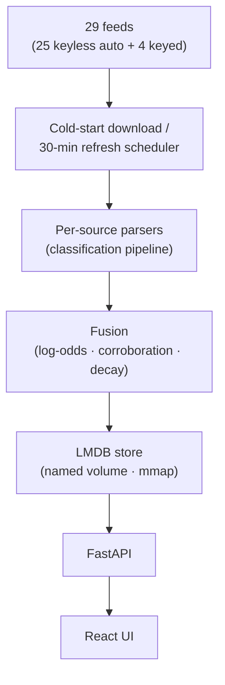

#  IP Radar

**English** | [简体中文](README.zh-CN.md)


**Pull 29 public threat feeds into your own box.** Every lookup comes back with a verdict in plain words — evidence, confidence, geo & ASN, all at once. One command, self-hosted.

[](LICENSE)


[](https://ipradar.huxiao0207.dpdns.org)

> The live demo runs in read-only mode (sources & updates disabled; queries fully working). Self-host to unlock everything.

<p align="center">
<table>
  <tr>
    <td width="50%" align="center"><br><sub>☠️ Malicious IP — per-source evidence + confidence-scored verdict</sub></td>
    <td width="50%" align="center"><br><sub>🌱 Clean IP — geo · city · ASN enrichment</sub></td>
  </tr>
</table>
</p>

<p align="center">
<sub>🚀 Try it in the <a href="https://ipradar.huxiao0207.dpdns.org">live demo</a> — click a sample:</sub><br>
<b><a href="https://ipradar.huxiao0207.dpdns.org/?ip=80.82.77.139">☠️ Malicious IP</a> · <a href="https://ipradar.huxiao0207.dpdns.org/?ip=185.220.101.1">🕵️ Tor/VPN exit</a> · <a href="https://ipradar.huxiao0207.dpdns.org/?ip=1.12.0.72">🌱 Clean IP</a></b>
</p>

## Quick Start

The whole stack — FastAPI backend + built frontend — runs in one container. Docker Compose v2.24+ required (`docker compose version` to check).

```bash
git clone https://github.com/steponeerror/ip-radar.git
cd ip-radar
docker compose up -d --build
```

Open http://127.0.0.1:8000. The container is reachable within seconds — a banner at the top tracks the keyless feeds' download/build progress live (25 of 29 sources, including geo/city/ASN and the major blocklists), and queries unlock automatically once the build settles. Subsequent starts load from the `ipradar-data` volume in seconds.

**25 of 29 feeds need zero API keys.** To light up the 4 keyed sources, drop the keys into `.env.local` (gitignored, overrides `.env`):

```bash
cp .env .env.local   # then open .env.local in any editor, fill keys
docker compose up -d
```

| Source | Variable | Get a key |
|---|---|---|
| ipinfo_lite | `IPINFO_TOKEN` | <https://ipinfo.io/account/token> |
| abuseipdb | `ABUSEIPDB_API_KEY` | <https://www.abuseipdb.com/account> |
| otx | `OTX_API_KEY` | <https://otx.alienvault.com/settings> |
| ip2proxy | `IP2PROXY_TOKEN` | <https://www.ip2location.com/> |

Slow npm/pip downloads (common on CN networks)? Pass mirror build-args:

```bash
docker compose build --build-arg PIP_INDEX_URL=https://pypi.tuna.tsinghua.edu.cn/simple \
                      --build-arg NPM_REGISTRY=https://registry.npmmirror.com
```

Notes:

- The port binds to `127.0.0.1` by default; to go LAN/public, edit `ports` in `docker-compose.yml` — mind that the API has **no authentication**.
- Each feed has its own usage terms; commercial use is your responsibility (this repo's AGPL-3.0 covers code only).
- Upgrade: `git pull && docker compose up -d --build` — the data volume stays right where it is.
- Disk: budget ≥6 GB for the data volume.

## Features

- **Works out of the box** — first start downloads and builds every keyless feed into millions of records (live count: `/api/db-status`).
- **Cold start doesn't block** — the container opens within seconds; queries unlock only when the keyless feeds are fully built. Never a verdict on half a dataset.
- **A verdict, not a pile of lists** — one line of conclusion per IP, per-source evidence on the table, 0-100 confidence (log-odds Bayesian fusion: source reliability → logit coefficients, 60-day half-life decay on threat assertions, cross-source corroboration; 0 = no evidence, not innocence; scalar fields don't decay).
- **Geo · City · ASN** — GeoLite2 for the city, iptoasn for the ASN, plus CN ISP classification incl. HK/MO/TW.
- **Proxy · VPN · Tor · CDN, spotted at a glance** — open proxies, VPN ranges, Tor exits, and the big three CDNs' edges, all labeled.
- **IPv6 lookups too** — bare v6 and small v6 CIDRs resolve with geo · city · ASN · VPN · CDN · DROP ranges; ~10 feeds carry v6 data, the rest have no v6 upstream — shown honestly as no-records.
- **One container, memory that behaves** — concurrency bends to host RAM; background refresh staggered per source: daily feeds 2×/day, weekly 1×/week, each at a fixed offset time.
- **STIX 2.1 export (optional)** — `/api/lookup/{ip}/stix`; the Docker image ships without `stix2` — `pip install stix2` to switch it on.

## Architecture



Fused, stored, and queried on your own machine — your lookups never leave it.

## API

Open http://127.0.0.1:8000 and type any IP: verdict, per-source evidence, and geo/ASN come back together. The API works directly too:

```bash
# core lookup
curl -s http://127.0.0.1:8000/api/lookup/1.12.0.1
# → {"ip":"1.12.0.1","country":{"value":"CN",..},"city":{"value":"Guangzhou",..},"asn":{"value":132203,..},"classifications":{..},"attributes":{..}}

# record count & status
curl -s http://127.0.0.1:8000/api/db-status

# loaded sources
curl -s http://127.0.0.1:8000/api/sources
```

The other management endpoints (update-db / tasks / events, …) live in the code; the UI triggers refreshes with one click too. Mind: the API has no authentication — don't expose the port to untrusted networks.

### Fail2ban integration: ask before you ban

`scripts/fail2ban/ipradar.conf` is a fail2ban action that triages every ban against your local IP Radar verdict first: confirmed-malicious IPs (confidence ≥ 70, tunable) go on a persistent long-ban list; CDN/infra edges skip the ban entirely with a loud log line — no more banning Cloudflare. Install & options: [`scripts/fail2ban/README.md`](scripts/fail2ban/README.md).

### Graylog integration: log enrichment

Use Graylog's built-in Lookup Tables (HTTP JSONPath adapter) to turn source IPs into country, ASN, and a fused threat verdict (`threat.verdict` / `threat.confidence`) — no plugin, unlimited local lookups, nothing leaves the machine. Step-by-step config + pipeline rules: [`integrations/graylog/README.md`](integrations/graylog/README.md).

### Wazuh integration: alert enrichment (local alternative to the VirusTotal integration)

`integrations/wazuh/custom-ipradar` enriches every IP-bearing Wazuh alert into an ECS `threat.indicator` follow-up alert — unlimited local lookups, your alert IPs never leave the machine. Install, ossec.conf snippet, and sample alert: [`integrations/wazuh/README.md`](integrations/wazuh/README.md).

## Adding Sources with AI

The repo ships three AI agent skills (`.pi/skills/`) — with an agent that loads project-level skills (e.g. [pi](https://github.com/earendil-works/pi)), one sentence lets AI wire the source in for you:

| Skill | When | Example |
|---|---|---|
| `discover-intel-sources` | No source picked yet; want an evaluated shortlist | "Find me a few threat-intel sources worth adding" |
| `add-intel-source` | A specific source is chosen; wire it in end-to-end | "Add GreyNoise" |
| `manage-intel-source` | Manage existing sources: health-check, update, replace | "Check the health of all sources" |

## Data Sources & Acknowledgments

Every dataset below belongs to its provider — thank you for keeping them open and maintained. 🔑 = needs a free/paid API key (where to put it: [Quick Start](#quick-start)); `*` = aggregator, credit flows to the upstream list maintainers.

### Threat Reputation

| Source | Provider | Contributes | 🔑 |
|---|---|---|---|
| abuseipdb | [AbuseIPDB](https://www.abuseipdb.com/) | Most-reported attacker IPs | 🔑 |
| otx | [AlienVault OTX](https://otx.alienvault.com/) | Community threat pulses (IPv4 indicators) | 🔑 |
| spamhaus | [Spamhaus](https://www.spamhaus.org/drop/) | DROP/EDROP hijacked ranges | |
| stopforumspam | [StopForumSpam](https://www.stopforumspam.com/) | Forum-spammer IPs (365-day window, report counts) | |
| threatfox | [abuse.ch](https://threatfox.abuse.ch/) | Malware IOC feed (CSV/ZIP) | |
| urlhaus | [abuse.ch](https://urlhaus.abuse.ch/) | Malicious URLs → IPs | |
| tweetfeed `*` | [TweetFeed](https://github.com/0xDanielLopez/TweetFeed) | Crowd-sourced IOCs from X/Twitter | |
| ipsum `*` | [IPsum](https://github.com/stamparm/ipsum) | Daily compile of many public blocklists | |
| firehol `*` | [FireHOL](https://github.com/firehol/blocklist-ipsets) | Level1/2 + abusers/proxies/webserver sublists | |
| blocklist_de `*` | [Blocklist.de](https://www.blocklist.de/) | 10 attack-type sublists + aggregate | |
| emerging_threats | [Proofpoint ET](https://rules.emergingthreats.net/) | Provenance-curated firewall blocklist | |
| binarydefense | [Binary Defense](https://www.binarydefense.com/banlist.txt) | Honeypot attacker banlist | |
| bruteforce | [BruteForceBlocker](https://danger.rulez.sk/) | SSH brute-force attacker IPs | |
| ciarm | [CINS Army](https://cinsscore.com/) | Passive-reputation bad-guys list | |
| greensnow | [GreenSnow](https://greensnow.co/) | Compromised-host blocklist | |
| dataplane | [Dataplane.org](https://dataplane.org/) | Rolling 7-day sensor signals (merged) | |
| dshield | [DShield](https://feeds.dshield.org/block.txt) | Top-attacker /24 blocks (attack counts) | |
| f3csystems | [f3cSystems](https://github.com/f3cSystems/BlockList_IP) | Honeypot scanner blocklist (Sekoia sensors) | |
| reportedip | [ReportedIP](https://github.com/reportedip/reportedip-blacklist) | WordPress-honeypot community reputation | |

### Geo & ASN

| Source | Provider | Contributes | 🔑 |
|---|---|---|---|
| geolite_city | [MaxMind GeoLite2](https://github.com/P3TERX/GeoLite.mmdb) | City / geo per IP | |
| iptoasn | [IPtoASN](https://iptoasn.com/) | ASN + AS-name ranges | |
| cn_isp | [clang.cn ISP ranges](https://ispip.clang.cn/) | China ISP classification (mainland + HK/MO/TW) | |
| ipinfo_lite | [IPinfo](https://ipinfo.io/) | Country / ASN / ranges enrichment | 🔑 |

### Asset & Network Surface

| Source | Provider | Contributes | 🔑 |
|---|---|---|---|
| ip2proxy | [IP2Location](https://www.ip2location.com/) | PX2 LITE proxy ranges | 🔑 |
| proxyscrape | [ProxyScrape](https://github.com/proxyscrape/free-proxy-list) | Open proxy IPs | |
| tor_exits | [Tor Project](https://check.torproject.org/exit-addresses) | Tor exit node addresses | |
| x4bnet_vpn | [X4BNet](https://github.com/X4BNet/lists_vpn) | VPN ranges | |
| cdn_edges | [AWS](https://ip-ranges.amazonaws.com/ip-ranges.json) · [Cloudflare](https://www.cloudflare.com/ips-v4) · [Fastly](https://api.fastly.com/public-ip-list) | CDN edge ranges | |
| infra_services | curated | Public DNS-root / NTP infrastructure | |

## Development

**Dev mode** (frontend hot-reload on :5173, backend API on :8000):

```bash
./dev.sh
```

**Or run each side yourself** (mind: `--host 0.0.0.0` exposes the **unauthenticated** API to your LAN/public network — use only if you know what you're doing):

```bash
# backend (first run: python3 -m venv .venv && .venv/bin/pip install -r requirements-dev.txt)
cd backend && source .venv/bin/activate
uvicorn main:app --reload --host 0.0.0.0 --port 8000

# frontend
cd frontend && npm run dev
```

**Production-style** (builds frontend, serves everything on :8000):

```bash
./start.sh
```

## Tests

```bash
# backend
cd backend
[ -d .venv ] || python3 -m venv .venv
.venv/bin/pip install -r requirements-dev.txt
.venv/bin/python -m pytest -q

# frontend
cd frontend && npm test
```

## Updating

The banner at the top tells you when a new release lands (hit "Check for updates" to refresh), with a copy-paste command:

```
git pull && docker compose up -d --build
```

To update from the page itself, uncomment the self-update mounts in `docker-compose.yml` (docker.sock + repo dir + token), restart, and an "Update now" button appears. The repo-dir mount must use an absolute host path (e.g. `/home/you/ip-radar:/app/repo`) — a `./` relative path breaks the in-container compose replay. Note: mounting docker.sock grants the container host-level root control — recommended for LAN self-hosting only; you'll paste your `IP_RADAR_UPDATE_TOKEN` once on first update. Known quirks: files written by in-container git pull are owned by root — host-side repo operations may need sudo or `git safe.directory`; and if you edit tracked files in the repo (like `.env`), `git pull --ff-only` will refuse to update by design — put local overrides in `.env.local` instead.

## License

© 2026 steponeerror, licensed under [AGPL-3.0](LICENSE); each intelligence feed keeps its own terms.

If you cite, build on, or fork this project, please follow AGPL-3.0: keep this license and the copyright notice, and mark what you changed; if you offer a network service built on it, its source must also be released under AGPL-3.0. If this project helps your research, writing, or product, a citation is appreciated: `https://github.com/steponeerror/ip-radar`.

## About This Code

This project was written by vibe coding. It surely has its quirks and rough edges; please be understanding, and file an [issue](https://github.com/steponeerror/ip-radar/issues) when you spot one.

## Epilogue

My previous employer — a certain TJ threat-intelligence company: the atmosphere was friendly, the pace was gentle; they simply owed me over half a year of wages, and after labor arbitration, still did not pay.

To be honest, I hold no grudge against them — as a worker, we simply stand on different sides. That said, the way the company handled it was not right.

And banning my account — a perfectly normal one, using nothing but their free basic services? That was a bit much.

This project is dedicated to the legitimate rights of every worker — and to one simple belief: basic IP intelligence should be available to everyone.

## 404Starlink


IP Radar has joined [404Starlink](https://github.com/knownsec/404StarLink)
