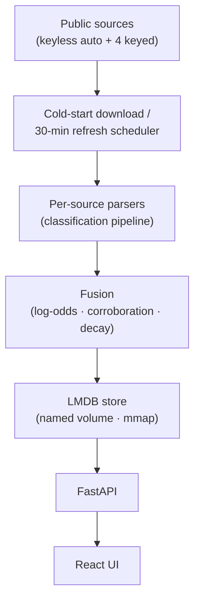

#  IP Radar

[English](README.md) | **简体中文**


把 42 个公开情报源搬回家：查任何 IP，拿一份全面的画像——说人话的裁决、逐源证据、置信度，加上地理·城市·ASN、云/托管、代理/VPN/Tor、服务身份，一次看全。一条命令，自己部署。

[](LICENSE)


[](https://ipradar.huxiao0207.dpdns.org)

> **演示模式** —— 数据源管理与更新已禁用，查询功能完整可用；自部署解锁全部能力。

<p align="center">
<table>
  <tr>
    <td width="50%" align="center"><br><sub>☠️ 恶意 IP：逐源证据 + 置信度裁决</sub></td>
    <td width="50%" align="center"><br><sub>🌱 干净 IP：地理 · 城市 · ASN 富化</sub></td>
  </tr>
</table>
</p>

<p align="center">
<sub>🚀 在线演示 <a href="https://ipradar.huxiao0207.dpdns.org"><b>ipradar.huxiao0207.dpdns.org</b></a> —— 点下面的示例，直接在 Demo 里看结果：</sub><br>
<b><a href="https://ipradar.huxiao0207.dpdns.org/?ip=80.82.77.139">☠️ 恶意 IP</a> · <a href="https://ipradar.huxiao0207.dpdns.org/?ip=185.220.101.1">🕵️ Tor/VPN 出口</a> · <a href="https://ipradar.huxiao0207.dpdns.org/?ip=1.12.0.72">🌱 干净 IP</a></b>
</p>

## 快速开始

### Docker（自托管推荐）

一个容器装下全部（FastAPI 后端 + 构建好的前端）。Docker Compose 要 v2.24+（`docker compose version` 看一眼）。

```bash
git clone https://github.com/steponeerror/ip-radar.git
cd ip-radar
docker compose up -d --build
```

打开 http://127.0.0.1:8000。首次启动数秒内容器即可访问——页面顶部横幅会实时展示免密钥源（除 4 个密钥源外全部，含地理/城市/ASN、主要封禁列表与云网段）的下载/构建进度，构建完成后查询自动解锁；之后每次启动都从 `ipradar-data` 卷秒级加载。

想开 4 个密钥源（ipinfo_lite / abuseipdb / otx / ip2proxy）？把密钥写进 `.env.local`（已 gitignore，盖过 `.env`）：

```bash
cp .env .env.local   # 编辑 .env.local 填入密钥
docker compose up -d
```

四个变量，去哪申请（`.env` 里也有同样的注释）：

| 源 | 变量 | 申请 |
|---|---|---|
| ipinfo_lite | `IPINFO_TOKEN` | <https://ipinfo.io/account/token> |
| abuseipdb | `ABUSEIPDB_API_KEY` | <https://www.abuseipdb.com/account> |
| otx | `OTX_API_KEY` | <https://otx.alienvault.com/settings> |
| ip2proxy | `IP2PROXY_TOKEN` | <https://www.ip2location.com/> |

npm/pip 下载慢（国内网络常见）——传镜像 build-args：

```bash
docker compose build --build-arg PIP_INDEX_URL=https://pypi.tuna.tsinghua.edu.cn/simple \
                      --build-arg NPM_REGISTRY=https://registry.npmmirror.com
```

注意：

- 端口默认只绑 `127.0.0.1`；要上局域网/公网，改 `docker-compose.yml` 的 `ports`——注意本 API **没有任何鉴权**。
- 各源有自己的使用条款，商用责任自负（本仓库的 AGPL-3.0 只管代码）。
- 升级：`git pull && docker compose up -d --build`，数据卷原地保留。
- 磁盘：给数据卷留够 ≥6 GB。

### 开发模式

**dev 模式**（前端 :5173 热更新，后端 API 走 :8000）：

```bash
./dev.sh
```

**想分开跑也行**（注意 `--host 0.0.0.0` 会把**无鉴权**的 API 暴露给局域网/公网，仅在清楚后果时使用）：

```bash
# backend（首次：python3 -m venv .venv && .venv/bin/pip install -r requirements-dev.txt）
cd backend && source .venv/bin/activate
uvicorn main:app --reload --host 0.0.0.0 --port 8000

# frontend
cd frontend && npm run dev
```

**类生产**（构建前端，一切都走 :8000）：

```bash
./start.sh
```

### 评估层

评估层并排给出两种可靠性数字：声明的 `r`（逐源手工设定，生产权威）与实测
θ（独立印证后验，advisory）。θ 从不是准确率声明，也从不自动写入生产权重——
采纳实测值必须走一个人审 PR，并在 diff 里引用评估报告。

在 `backend/` 下用 `python -m ipdb._eval` 驱动：`--audit`（谱系审计——基于
持久化模型历史的镜像方向裁决，advisory）、`--anchors`（已知答案回归闸，
任一失败退出码 1）、`--dsem`（DS-EM 公平对决：市场 vs 声明 vs π̂，
advisory）。数据源页同样双轨展示——实测 θ（90% CI）与各源声明 `r` 并列。

## 特性

- **开箱即用，除 4 个密钥源外全部免密钥** —— 首次启动自动下载构建，数百万条记录入库（确切数量以 `/api/db-status` 实测为准）；剩下 4 个 🔑 源想开的话，密钥填法见[快速开始](#快速开始)。
- **冷启动不挡路** —— 容器数秒就能打开，免密钥源的下载/构建进度在页面顶部横幅实时滚动，建完查询自动解锁——绝不拿着半份数据先给结论。
- **一份裁决，不是一堆列表** —— 单 IP 一句话结论，逐源证据摆给你看，0-100 置信度（log-odds 贝叶斯融合：源可靠性转对数几率系数、威胁断言按 60 天半衰期衰减、交叉佐证；0 = 无证据，而非清白；标量字段不衰减，city/ip_range 保留原语义）。
- **地理 · 城市 · ASN** —— GeoLite2 + DB-IP 两票给城市，iptoasn 给自治域，CN ISP 归属（含港澳台）也认得。
- **代理 · VPN · Tor · CDN · 云，一眼认出来** —— 实检代理列表、VPN 网段（含 NordVPN、ProtonVPN）、Tor 出口、三大 CDN 边缘、AWS/GCP/Azure/Oracle 托管网段，都标得清清楚楚；知名基础设施还会亮出服务身份（8.8.8.8 → DNS · Google Public DNS）。
- **IPv6 也能查** —— 裸 v6 / 小段 v6 CIDR 直接查，地理·城市·ASN·VPN·CDN·封禁段对 v6 生效；地理/城市/ASN、云厂商网段、CDN 边缘、DROPv6 等源原生覆盖 v6；多数威胁列表上游本就无 v6 数据，如实显示无记录。
- **一个容器跑全栈，内存自己看着办** —— `docker compose up -d --build` 就有；并发按宿主机内存自动收敛，后台自动刷新按源错峰：日更源每天 2 次、周更源每周 1 次，各源固定时刻错开。
- **STIX 2.1 导出（可选）** —— `/api/lookup/{ip}/stix` 一键导出；Docker 镜像默认不带 `stix2`，`pip install stix2` 装上即开。

## 架构



融合、存储、查询，全在你本地——你的查询不发给任何第三方。

## 使用

打开 http://127.0.0.1:8000，随手输一个 IP：裁决、逐源证据、地理/ASN 一起回来。API 也能直接用：

```bash
# 核心查询
curl -s http://127.0.0.1:8000/api/lookup/1.12.0.1
# → {"ip":"1.12.0.1","country":{"value":"CN",..},"city":{"value":"Guangzhou",..},"asn":{"value":132203,..},"classifications":{..},"attributes":{..}}

# 记录数与状态
curl -s http://127.0.0.1:8000/api/db-status

# 源装载清单
curl -s http://127.0.0.1:8000/api/sources
```

其余管理端点（update-db / tasks / events 等）都在代码里；UI 上点一下也能触发刷新。提醒：本 API 无鉴权，勿将端口暴露给不受信网络。

### Fail2ban 集成：拉黑前先问一句

`scripts/fail2ban/ipradar.conf` 提供一个 fail2ban action：ban 之前先查本地 IP Radar 裁决——确认恶意（confidence ≥ 70 可调）则记入长封名单；CDN/基础设施边缘直接跳过 ban 留日志，不再误封 Cloudflare。装法与参数见 [`scripts/fail2ban/README.md`](scripts/fail2ban/README.md)。

### Graylog 集成：日志富化

用 Graylog 内置 Lookup Table（HTTP JSONPath adapter）把日志里的源 IP 换成国家、ASN 和融合威胁裁决（`threat.verdict` / `threat.confidence`）——无插件、查询不出网、无限量。配置步骤与 pipeline 规则见 [`integrations/graylog/README.md`](integrations/graylog/README.md)。

### Wazuh 集成：告警富化（VirusTotal 集成的本地替代）

`integrations/wazuh/custom-ipradar` 把每条带 IP 的 Wazuh 告警富化为 ECS `threat.indicator` 跟进告警——本地无限量查询，不把告警 IP 送给第三方。装法、ossec.conf 配置与告警样例见 [`integrations/wazuh/README.md`](integrations/wazuh/README.md)。

## 用 AI 扩展数据源

仓库还自带三个 AI agent skills（`.pi/skills/`）——用支持项目级 skills 的编码代理（如 [pi](https://github.com/earendil-works/pi)），一句话就能让 AI 替你把源加上：

| Skill | 什么时候用 | 一句话示例 |
|---|---|---|
| `discover-intel-sources` | 还没想好加哪个源，先要候选清单与评估 | “帮我找几个值得加的威胁情报源” |
| `add-intel-source` | 已选定某个源，要完整接入 | “把 GreyNoise 加进来” |
| `manage-intel-source` | 管理现有源：体检、更新、替换 | “看看各源的健康状况” |

## 数据源与致谢

下面每一份数据都属于它的提供方——感谢它们一直开放、一直维护。🔑 = 要免费/付费密钥（去哪填见[快速开始](#快速开始)）；`*` = 聚合源，荣誉归于上游列表的维护者。

### 威胁信誉

| 源 | 提供方 | 贡献 | 🔑 |
|---|---|---|---|
| abuseipdb | [AbuseIPDB](https://www.abuseipdb.com/) | Most-reported attacker IPs | 🔑 |
| otx | [AlienVault OTX](https://otx.alienvault.com/) | Community threat pulses (IPv4 indicators) | 🔑 |
| spamhaus | [Spamhaus](https://www.spamhaus.org/drop/) | DROP/EDROP hijacked ranges | |
| stopforumspam | [StopForumSpam](https://www.stopforumspam.com/) | Forum-spammer IPs (365-day window, report counts) | |
| threatfox | [abuse.ch](https://threatfox.abuse.ch/) | Malware IOC feed (CSV/ZIP) | |
| urlhaus | [abuse.ch](https://urlhaus.abuse.ch/) | Malicious URLs → IPs | |
| tweetfeed `*` | [TweetFeed](https://github.com/0xDanielLopez/TweetFeed) | Crowd-sourced IOCs from X/Twitter | |
| ipsum `*` | [IPsum](https://github.com/stamparm/ipsum) | Daily compile of many public blocklists | |
| firehol `*` | [FireHOL](https://github.com/firehol/blocklist-ipsets) | Aggregated blocklist levels | |
| blocklist_de `*` | [Blocklist.de](https://www.blocklist.de/) | 10 attack-type sublists + aggregate | |
| emerging_threats | [Proofpoint ET](https://rules.emergingthreats.net/) | Provenance-curated firewall blocklist | |
| binarydefense | [Binary Defense](https://www.binarydefense.com/banlist.txt) | Honeypot attacker banlist | |
| bruteforce | [BruteForceBlocker](https://danger.rulez.sk/) | SSH brute-force attacker IPs | |
| ciarm | [CINS Army](https://cinsscore.com/) | Passive-reputation bad-guys list | |
| greensnow | [GreenSnow](https://greensnow.co/) | Compromised-host blocklist | |
| dataplane | [Dataplane.org](https://dataplane.org/) | Rolling 7-day sensor signals (merged) | |
| dshield | [DShield](https://feeds.dshield.org/block.txt) | Top-attacker /24 blocks (attack counts) | |
| f3csystems | [f3cSystems](https://github.com/f3cSystems/BlockList_IP) | Honeypot scanner blocklist (Sekoia sensors) | |
| reportedip | [ReportedIP](https://github.com/reportedip/reportedip-blacklist) | WordPress-honeypot community reputation | |
| siberkapan | [SiberKapan](https://siberkapan.org/) | Turkish honeypot-network sensor blocklist | |
| threatcluster | [ThreatCluster](https://threatcluster.io/) | Curated high-confidence malicious IPs | |
| turris_greylist | [Turris Sentinel](https://view.sentinel.turris.cz/greylist-data/) | Distributed-router greylist (protocol probes) | |
| drb_ra `*` | [C2IntelFeeds](https://github.com/drb-ra/C2IntelFeeds) | Aggregated C2 IPs (30-day hunts) | |

### 地理与 ASN

| 源 | 提供方 | 贡献 | 🔑 |
|---|---|---|---|
| geolite_city | [MaxMind GeoLite2](https://github.com/P3TERX/GeoLite.mmdb) | City / geo per IP | |
| dbip_city | [DB-IP](https://db-ip.com/db/lite.php) | City-lite — 2nd city voting source | |
| iptoasn | [IPtoASN](https://iptoasn.com/) | ASN + AS-name ranges | |
| cn_isp | [clang.cn ISP ranges](https://ispip.clang.cn/) | China ISP classification (mainland + HK/MO/TW) | |
| ipinfo_lite | [IPinfo](https://ipinfo.io/) | Country / ASN / ranges enrichment | 🔑 |

### 资产与网络面

| 源 | 提供方 | 贡献 | 🔑 |
|---|---|---|---|
| ip2proxy | [IP2Location](https://www.ip2location.com/) | PX2 LITE proxy ranges | 🔑 |
| proxyscrape | [ProxyScrape](https://github.com/proxyscrape/free-proxy-list) | Open proxy IPs | |
| tor_exits | [Tor Project](https://check.torproject.org/exit-addresses) | Tor exit node addresses | |
| x4bnet_vpn | [X4BNet](https://github.com/X4BNet/lists_vpn) | VPN ranges | |
| nordvpn | [NordVPN](https://github.com/mthcht/awesome-lists) | NordVPN server ranges (mirror) | |
| protonvpn | [ProtonVPN](https://github.com/mthcht/awesome-lists) | ProtonVPN server ranges (mirror) | |
| hookzof | [hookzof](https://github.com/hookzof/socks5_list) | Live-checked SOCKS5 proxies | |
| thespeedx | [TheSpeedX](https://github.com/TheSpeedX/PROXY-List) | Live-checked HTTP proxies | |
| cdn_edges | [CloudFront](https://ip-ranges.amazonaws.com/ip-ranges.json) · [Cloudflare](https://www.cloudflare.com/ips-v4) · [Fastly](https://api.fastly.com/public-ip-list) | CDN edge ranges | |
| aws_ranges | [AWS](https://ip-ranges.amazonaws.com/ip-ranges.json) | Full AWS footprint — cloud / hosting | |
| gcp_ranges | [Google](https://www.gstatic.com/ipranges/goog.json) | Google public ranges — cloud / hosting | |
| azure_ranges | [Azure](https://www.microsoft.com/en-us/download/details.aspx?id=56519) | AzureCloud service tag — cloud / hosting | |
| oracle_ranges | [Oracle](https://docs.oracle.com/iaas/tools/public_ip_ranges.json) | OCI region ranges — cloud / hosting | |
| infra_services | curated | Public DNS-root / NTP infrastructure | |

## 测试

首次先装依赖（含 pytest / stix2）：

```bash
# backend（在 backend/ 下）
cd backend
[ -d .venv ] || python3 -m venv .venv
.venv/bin/pip install -r requirements-dev.txt
.venv/bin/python -m pytest -q

# frontend（在 frontend/ 下）
cd frontend && npm test
```

## 版本通知与一键更新

页面顶部的版本横幅会提示新版本（点击「检查更新」手动查询），并给出复制即用的更新命令：

```
git pull && docker compose up -d --build
```

想省去 SSH：在 `docker-compose.yml` 取消注释自更新挂载模板（docker.sock + 仓库目录 + token 三件套）后 `docker compose up -d`，横幅上会出现「立即更新」。仓库目录挂载需用宿主机上的绝对路径（如 `/home/you/ip-radar:/app/repo`，不能用 `./` 相对路径，否则容器内重放 compose 时解析不到宿主机目录）。注意：挂载 docker.sock 等于赋予容器宿主机 root 级控制权，仅建议内网自托管使用；页面首次更新时需粘贴一次部署时配置的 `IP_RADAR_UPDATE_TOKEN`。已知事项：容器内 git pull 写入的文件归 root，若之后在宿主机上直接操作仓库可能遇到权限提示（`sudo` 或 `git config --global --add safe.directory` 即可）；若直接修改了仓库内被跟踪的文件（如 `.env`），`git pull --ff-only` 会更新失败，这是预期保护，改用 `.env.local` 放本地覆盖即可。

## 许可证

© 2026 steponeerror，采用 [AGPL-3.0](LICENSE) 授权；各情报源有自己的使用条款。

引用、魔改或 fork 本项目时，请遵守 AGPL-3.0：保留本许可与版权声明、标明你修改过的部分；基于本项目的衍生作品对外提供网络服务时，也须以 AGPL-3.0 开源。如果这个项目对你的研究、文章或产品有帮助，欢迎引用：`https://github.com/steponeerror/ip-radar`。

## 关于这份代码

这个项目是 vibe coding 写出来的。它必然有这样那样的问题；请多包涵，也欢迎到 [Issues](https://github.com/steponeerror/ip-radar/issues) 告诉我哪里不对。

## 后记

某 TJ 威胁情报公司：工作氛围友好，强度也不高——只是欠了我大半年的工资，劳动仲裁之后，依然没有支付。

说实话，我对它并没有恨意，只是作为工作者立场不同。同时公司的处理方式并不正确。

只是，我用正常账号访问公司的免费基础服务，你把我的号封了——这就有点离谱了吧。

本项目致力于维护劳动者的合法权益，同时保证人人都有基础的 IP 情报可用。

## 404星链计划


IP Radar 现已加入 [404星链计划](https://github.com/knownsec/404StarLink)
